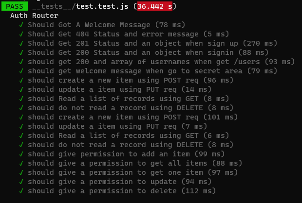
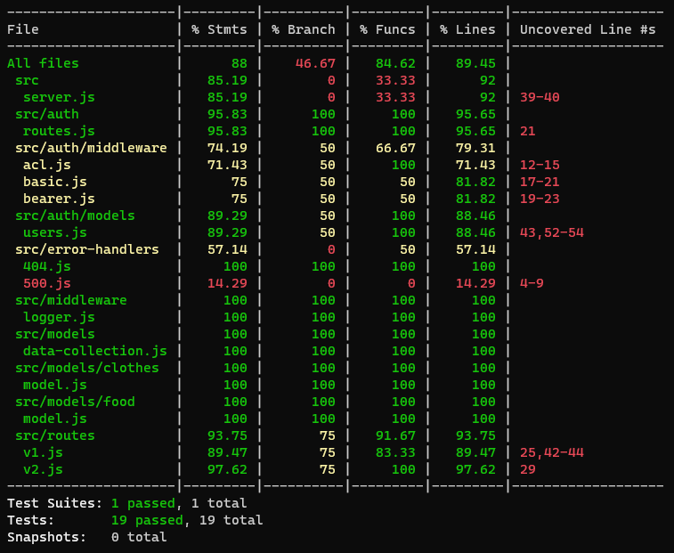
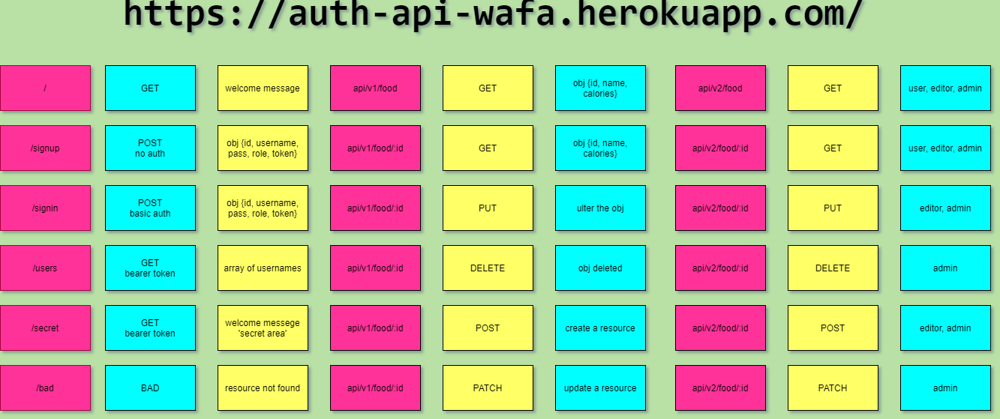

# AUTH-API ~

### DEPLOYED APP : " [Auth API](https://wafa-auth-api.herokuapp.com/) "

Implement a Role Based Access Control (RBAC) using an Access Control List (ACL), allowing to not only restrict access to routes for valid users, but also based on the individual permissions we give each user.

***

## restrictions:

- Regular users can READ
- Writers can READ and CREATE
- Editors can READ, CREATE, and UPDATE
- Administrators can READ, CREATE, UPDATE, and DELETE

Routes that end up performing those actions in our API/Database protected by both a valid user and that user’s permissions

***

## routes:

- POST /signup to create a user
- POST /signin to login a user and receive a token
- GET /secret should require a valid bearer token
- GET /users should require a valid token and “delete” permissions

***

## Created a set of routes (V2) within the server

- V2 API Routes (/api/v2/...) protected with the proper permissions based on user capability, using Bearer Authentication and an ACL

- app.get(...) require authentication only, no specific roles

- app.post(...) require both a bearer token and the create capability

- app.put(...) require both a bearer token and the update capability

- app.patch(...) require both a bearer token and the update capability

app.delete(...) require both a bearer token and the delete capability

***

## AUTH Routes

- POST /signup creates a new user and sends an object with the user and the token to the client
- POST /signin with basic authentication headers logs in a user and sends an object with the user and the token to the client

## V1 (Unauthenticated API) routes
- POST /api/v1/:model adds an item to the DB and returns an object with the added item
- GET /api/v1/:model returns a list of :model items
- GET /api/v1/:model/ID returns a single item by ID
- PUT /api/v1/:model/ID returns a single, updated item by ID
- DELETE /api/v1/:model/ID returns an empty object. Subsequent GET for the same ID should result in nothing found

## V2 (Authenticated API Routes)

- POST /api/v2/:model with a bearer token that has create permissions adds an item to the DB and returns an object with the added item
- GET /api/v2/:model with a bearer token that has read permissions returns a list of :model items
- GET /api/v2/:model/ID with a bearer token that has read permissions returns a single item by ID
- PUT /api/v2/:model/ID with a bearer token that has update permissions returns a single, updated item by ID
- DELETE /api/v2/:model/ID with a bearer token that has delete permissions returns an empty object. Subsequent GET for the same ID should result in nothing found

***

## Dependencies

```
    "@code-fellows/supergoose": "^1.0.11",
    "base-64": "^1.0.0",
    "bcrypt": "^5.0.0",
    "eslint": "^7.14.0",
    "cors": "^2.8.5",
    "dotenv": "^8.2.0",
    "express": "^4.17.1",
    "method-override": "^3.0.0",
    "jest": "^26.6.3",
    "jsonwebtoken": "^8.5.1",
    "mongoose": "^5.10.15",
    "morgan": "^1.10.0",
    "supertest": "^6.0.1"
```

***

## TREE 

```
auth-api |
         |__tests__
         |── src
         ├── auth
         │   ├── middleware
         │   │   ├── acl.js
         │   │   ├── basic.js
         │   │   └── bearer.js
         │   ├── models
         │   │   └── users.js
         │   └── routes.js
         ├── error-handlers
         │   ├── 404.js
         │   └── 500.js
         ├── middleware
         │   └── logger.js
         ├── models
         │   ├── clothes
         │   │   └── model.js
         │   ├── data-collection.js
         │   └── food
         │       └── model.js
         ├── routes
         │   ├── v1.js
         │   └── v2.js
         └── server.js
         |index.js
```

***


## TESTS 

[Actions](https://github.com/wafaankoush99/auth-api/actions)




***

## UML



***
